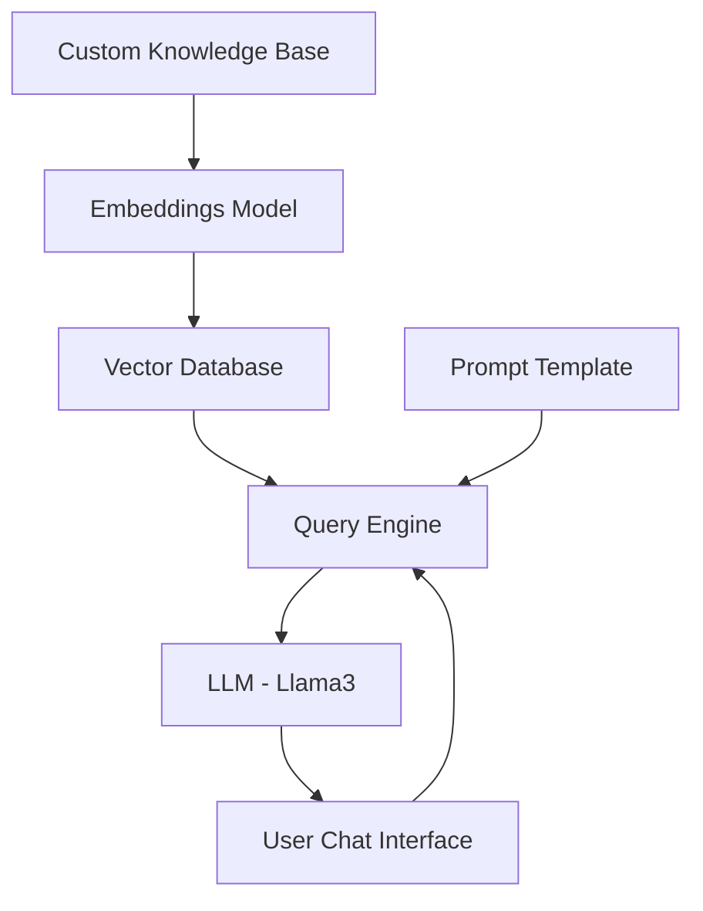

# RAG Application: Chat with Your Docs
## Key Architecture Components

<details>
<summary>Click to expand the architecture diagram</summary>



</details>

## Component Details

<details>
<summary>1. Custom Knowledge Base</summary>

A collection of relevant and up-to-date information that serves as a foundation for RAG. In this case, it's a PDF provided by you that will be used as a source of truth to provide answers to user queries.

```python
from llama_index.core import SimpleDirectoryReader

# load data
loader = SimpleDirectoryReader(
    input_dir = input_dir_path,
    required_exts=[".pdf"],
    recursive=True
)
docs = loader.load_data()
```
</details>

<details>
<summary>2. Embeddings Model</summary>

A technique for representing text data as numerical vectors, which can be input into machine learning models.

```python
from llama_index.embeddings.huggingface import HuggingFaceEmbedding

embed_model = HuggingFaceEmbedding(model_name="BAAI/bge-large-en-v1.5", trust_remote_code=True)
```
</details>

<details>
<summary>3. Vector Databases</summary>

A collection of pre-computed vector representations of text data for fast retrieval and similarity search.

```python
from llama_index.core import Settings
from llama_index.core import VectorStoreIndex

# Create vector store and upload indexed data
Settings.embed_model = embed_model
index = VectorStoreIndex.from_documents(docs)
```
</details>

<details>
<summary>4. User Chat Interface</summary>

A user-friendly interface built with Streamlit that allows users to interact with the RAG system. The code for it can be found in `app.py`.
</details>

<details>
<summary>5. Query Engine</summary>

The query engine fetches relevant context and sends it along with the query to the LLM to generate a final natural language response.

```python
from llama_index.llms.ollama import Ollama
from llama_index.core import Settings

# setting up the llm
llm = Ollama(model="llama3", request_timeout=120.0) 

# Setup a query engine on the index previously created
Settings.llm = llm
query_engine = index.as_query_engine(streaming=True, similarity_top_k=4)
```
</details>

<details>
<summary>6. Prompt Template</summary>

A custom prompt template used to refine the response from LLM & include the context:

```python
qa_prompt_tmpl_str = (
    "Context information is below.\n"
    "---------------------\n"
    "{context_str}\n"
    "---------------------\n"
    "Given the context information above I want you to think step by step to answer the query in a crisp manner, incase case you don't know the answer say 'I don't know!'.\n"
    "Query: {query_str}\n"
    "Answer: "
)

qa_prompt_tmpl = PromptTemplate(qa_prompt_tmpl_str)
query_engine.update_prompts({"response_synthesizer:text_qa_template": qa_prompt_tmpl})
```
</details>

## Try It Out!

<div id="chat-demo">
    <input type="text" id="user-input" placeholder="Ask a question about the RAG application...">
    <button onclick="sendMessage()">Send</button>
    <div id="chat-output"></div>
</div>

<script>
function sendMessage() {
    const input = document.getElementById('user-input');
    const output = document.getElementById('chat-output');
    const question = input.value;
    input.value = '';
    
    output.innerHTML += `<p><strong>You:</strong> ${question}</p>`;
    
    // Simulated response (replace with actual API call in a real application)
    setTimeout(() => {
        const response = "This is a simulated response. In a real application, this would be generated by the RAG system based on your question.";
        output.innerHTML += `<p><strong>RAG System:</strong> ${response}</p>`;
    }, 1000);
}
</script>

## Conclusion

In this studio, we developed a Retrieval Augmented Generation (RAG) application that allows you to "Chat with your docs." We learned about:

- LlamaIndex for building RAG applications
- Ollama for locally serving LLMs (Llama3 in this case)
- Prompt engineering techniques to refine LLM responses

These techniques can be applied to anchor your LLM to various knowledge bases, such as documents, PDFs, videos, and more.

Feel free to explore the code and experiment with different components to enhance the RAG application further!