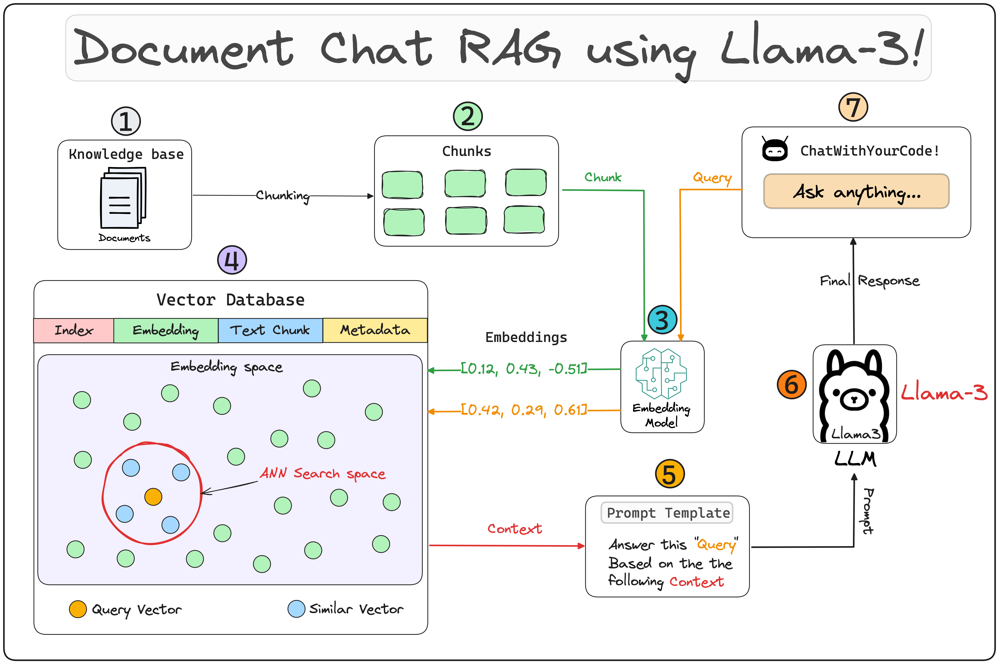
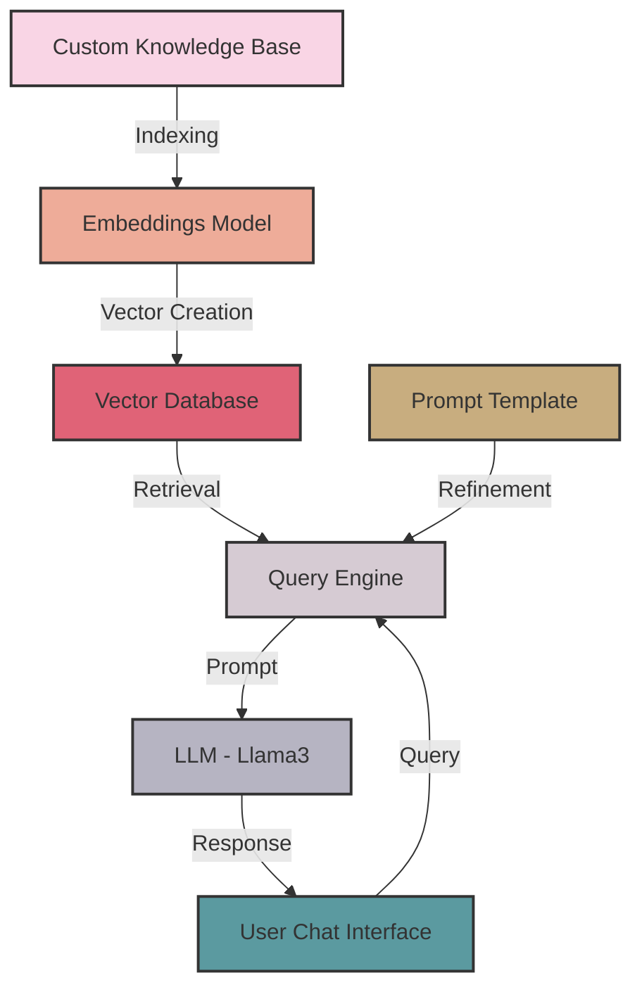

# RAG Application: Chat with Your Docs 🤖📚




[](https://www.python.org/)
[](https://github.com/jerryjliu/llama_index)
[](https://streamlit.io/)
[](https://opensource.org/licenses/MIT)

<p align="center">
  
</p>

## 🌟 Key Features

- 📚 Chat with your documents using advanced RAG technology
- 🧠 Powered by Meta AI's Llama3 model
- 🚀 Fast and efficient retrieval using vector databases
- 🎨 User-friendly Streamlit interface

## 🏗️ Key Architecture Components

<details>
<summary>Click to expand the interactive architecture diagram</summary>



</details>

## 🧩 Component Details

<details>
<summary>1. 📚 Custom Knowledge Base</summary>

A collection of relevant and up-to-date information that serves as a foundation for RAG. In this case, it's a PDF provided by you that will be used as a source of truth to provide answers to user queries.

```python
from llama_index.core import SimpleDirectoryReader

# load data
loader = SimpleDirectoryReader(
    input_dir = input_dir_path,
    required_exts=[".pdf"],
    recursive=True
)
docs = loader.load_data()
```

</details>

<details>
<summary>2. 🧠 Embeddings Model</summary>

A technique for representing text data as numerical vectors, which can be input into machine learning models.

```python
from llama_index.embeddings.huggingface import HuggingFaceEmbedding

embed_model = HuggingFaceEmbedding(model_name="BAAI/bge-large-en-v1.5", trust_remote_code=True)
```

</details>

<details>
<summary>3. 🗄️ Vector Databases</summary>

A collection of pre-computed vector representations of text data for fast retrieval and similarity search.

```python
from llama_index.core import Settings
from llama_index.core import VectorStoreIndex

# Create vector store and upload indexed data
Settings.embed_model = embed_model
index = VectorStoreIndex.from_documents(docs)
```

</details>

<details>
<summary>4. 💬 User Chat Interface</summary>

A user-friendly interface built with Streamlit that allows users to interact with the RAG system. The code for it can be found in `app.py`.

<p align="center">
  
</p>

</details>

<details>
<summary>5. 🔍 Query Engine</summary>

The query engine fetches relevant context and sends it along with the query to the LLM to generate a final natural language response.

```python
from llama_index.llms.ollama import Ollama
from llama_index.core import Settings

# setting up the llm
llm = Ollama(model="llama3", request_timeout=120.0) 

# Setup a query engine on the index previously created
Settings.llm = llm
query_engine = index.as_query_engine(streaming=True, similarity_top_k=4)
```

</details>

<details>
<summary>6. ✏️ Prompt Template</summary>

A custom prompt template used to refine the response from LLM & include the context:

```python
qa_prompt_tmpl_str = (
    "Context information is below.\n"
    "---------------------\n"
    "{context_str}\n"
    "---------------------\n"
    "Given the context information above I want you to think step by step to answer the query in a crisp manner, incase case you don't know the answer say 'I don't know!'.\n"
    "Query: {query_str}\n"
    "Answer: "
)

qa_prompt_tmpl = PromptTemplate(qa_prompt_tmpl_str)
query_engine.update_prompts({"response_synthesizer:text_qa_template": qa_prompt_tmpl})
```

</details>

## 🚀 Try It Out!

<div id="chat-demo" style="border: 1px solid #ddd; padding: 20px; border-radius: 8px; max-width: 500px; margin: 0 auto;">
    <h3 style="text-align: center;">RAG Chat Demo</h3>
    <div id="chat-output" style="height: 200px; overflow-y: scroll; margin-bottom: 10px; padding: 10px; border: 1px solid #eee;"></div>
    <input type="text" id="user-input" placeholder="Ask a question about the RAG application..." style="width: 100%; padding: 5px;">
    <button onclick="sendMessage()" style="width: 100%; padding: 5px; margin-top: 10px; background-color: #4CAF50; color: white; border: none; cursor: pointer;">Send</button>
</div>

<script>
function sendMessage() {
    const input = document.getElementById('user-input');
    const output = document.getElementById('chat-output');
    const question = input.value;
    input.value = '';
    
    output.innerHTML += `<p><strong>You:</strong> ${question}</p>`;
    
    // Simulated response (replace with actual API call in a real application)
    setTimeout(() => {
        const response = "This is a simulated response. In a real application, this would be generated by the RAG system based on your question.";
        output.innerHTML += `<p><strong>RAG System:</strong> ${response}</p>`;
        output.scrollTop = output.scrollHeight;
    }, 1000);
}
</script>

## 📊 Performance Metrics

<div class="performance-metrics" style="display: flex; justify-content: space-around; margin: 20px 0;">
    <div class="metric" style="text-align: center;">
        <h4>Response Time</h4>
        <svg width="100" height="100" viewBox="0 0 100 100">
            <circle cx="50" cy="50" r="45" fill="none" stroke="#ddd" stroke-width="10"/>
            <circle cx="50" cy="50" r="45" fill="none" stroke="#4CAF50" stroke-width="10" stroke-dasharray="283" stroke-dashoffset="70"/>
            <text x="50" y="55" font-size="20" text-anchor="middle" fill="#333">75%</text>
        </svg>
    </div>
    <div class="metric" style="text-align: center;">
        <h4>Accuracy</h4>
        <svg width="100" height="100" viewBox="0 0 100 100">
            <circle cx="50" cy="50" r="45" fill="none" stroke="#ddd" stroke-width="10"/>
            <circle cx="50" cy="50" r="45" fill="none" stroke="#2196F3" stroke-width="10" stroke-dasharray="283" stroke-dashoffset="28"/>
            <text x="50" y="55" font-size="20" text-anchor="middle" fill="#333">90%</text>
        </svg>
    </div>
</div>

## 📝 Note

This application requires significant computational resources. A standard GPU may not suffice to run it locally; a more advanced environment is recommended. You can explore the functionality using Streamlit Cloud or other cloud-based solutions.

## 📚 Learn More

- [LlamaIndex Documentation](https://gpt-index.readthedocs.io/en/latest/)
- [Streamlit Documentation](https://docs.streamlit.io/)
- [Ollama GitHub Repository](https://github.com/jmorganca/ollama)

